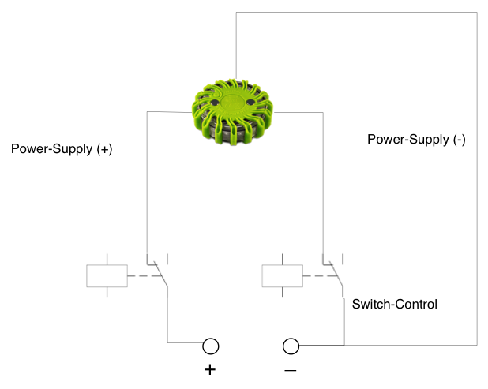

Powerflare Server
================

The powerflare-server can control 4 Powerflares <http://www.powerflare.de> using an USB-based Relay USB RLY08 <http://www.robot-electronics.co.uk/htm/usb_rly08tech.htm>

Connection Schema for one channel
-------------

Drivers
-------------
You can obtain the drivers (USB to Serial) at <http://www.ftdichip.com/FTDrivers.htm>

Starting the Server
-------------

Start the Server using either `powerflare-server.sh` or start directly using the main-class `de.paluch.powerflare.Server` with all dependencies.

You must supply as first command-line argument the serial device. Usually it's something like /dev/ttyUSB0 on *NIX systems.

Looks like then:

`powerflare-server.sh /dev/ttyUSB0` or `java -cp ... de.paluch.powerflare.Server /dev/ttyUSB0`

Control-Interface
-------------
The server has a builtin HTTP REST server. You can control/query the server using simple HTTP GET commands using following URL's:

* http://localhost:9998/powerflareUsbPower/{port:[0-4]}/{state:(ON|OFF)} to change PowerFlare-Status
* http://localhost:9998/powerflare/{port:[0-4]}/ to retrieve PowerFlare-Status
* http://localhost:9998/relay/{port:[0-8]}/{state:(CONNECT|DISCONNECT)} for Low-Level Relay Control

USB RLY08 is capable of handling 8 ports. 4 of them are used for power switching the other 4 are to control the on/off switch.
This leads to the conclusion, that only 4 devices can be switched/handled. So you can use port Id's 0-4 (0 = all), 1 = Port 1 and so on.

Examples:

`GET http://localhost:9998/powerflareUsbPower/1/ON HTTP/1.0` to switch Port 1 on

`GET http://localhost:9998/powerflare/1 HTTP/1.0` to receive the port status

Visit <http://www.paluch.biz> to see the Powerflares in action.

